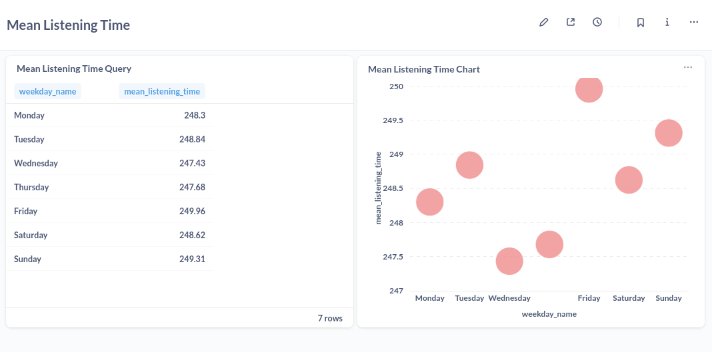

# 🎧 Spotify-like Data Lake Analytics Project

This project simulates a data pipeline and analytics system for a music streaming platform like Spotify. It covers the full data engineering lifecycle from raw event ingestion to structured analysis and dashboarding using Spark, HDFS, dbt, ClickHouse, and Metabase.

---

## 📦 Project Structure

```plaintext
.
├── docker-compose.yml          # Multi-container orchestration (Spark, Hadoop, ClickHouse, Metabase)
├── DBT/
│   └── models/
│       └── marts/              # dbt models for gold layer
│       └── staging/            # dbt models for silver layer
├── README.md                   # Project documentation (this file)
└── images/
    ├── daily_user_listen_counts.png
    ├── top_songs.png
    └── mean_listening_time.png
└── spark_jobs/ (some spark streaming jobs for bronze layer)
│
└── hadoop_conf/ (hdfs conf files)
```

---

## 🚀 Tech Stack

| Layer        | Tool/Image Used                                  |
|--------------|--------------------------------------------------|
| Ingestion    | Apache Spark (Structured Streaming)              |
| Storage      | HDFS (Hadoop Distributed File System)            |
| Transformation| dbt (with Spark adapter)                        |
| Query Engine | ClickHouse (`altinity/clickhouse-server:latest`) |
| BI/Visualization | Metabase (`metabase/metabase:latest`)       |
| Event Streaming | Kafka (kraft mode)                            |

---

## ⚙️ Data Lake Architecture

### 🧪 Bronze Layer

- Raw JSON log events ingested with Spark Structured Streaming.
- Stored in HDFS at:  
  `hdfs://hadoop-namenode:8020/user/bronze/`

### 🥈 Silver Layer

- Cleaned and structured datasets saved as Parquet:
  - `fact_listen_events`
  - `fact_auth_events`
  - `fact_page_view_events`
  - `dim_user`, `dim_song`, `dim_time`, `dim_location`
- Stored in HDFS at:  
  `hdfs://hadoop-namenode:8020/user/silver/`

### 🥇 Gold Layer

- Analytical tables built using **dbt** from the silver layer, including:
  - `conversion_rates`
  - `daily_user_listen_counts`
  - `event_status_grouping`
  - `free_vs_paid_users_comparison`
  - `mean_session_time`
  - `new_user_week1_behavior`
  - `top_songs_by_play_count`
  - `weekday_mean_listening_time`
- Stored in HDFS at:  
  `hdfs://hadoop-namenode:8020/user/gold/`

---

## 🛠 Example dbt Models (Gold Layer)

All gold tables are created in `DBT/models/marts/` and saved as Parquet files.

Example model: `daily_user_listen_counts.sql`

```sql
SELECT
    userId,
    year,
    month,
    day,
    COUNT(*) AS listen_count
FROM {{ ref('fact_listen_events') }}
GROUP BY userId, year, month, day
```

You can run all models using:

```bash
dbt run
```

---

## 🗃 ClickHouse HDFS Integration

The gold layer Parquet files are queried from **ClickHouse** using the HDFS engine.

Example:

```sql
CREATE TABLE Spotify.daily_user_listen_counts
(
    userId UInt32,
    year UInt16,
    month UInt8,
    day UInt8,
    listen_count UInt32
)
ENGINE = HDFS('hdfs://hadoop-namenode:8020/user/gold/daily_user_listen_counts/*.parquet', 'Parquet');
```

Repeat for all analytical models.

---

## 📊 Metabase Dashboards

**Metabase** is used for visualizing the final gold tables exposed via ClickHouse.

Dashboards created:
- 📅 Daily User Listen Counts
- 🎵 Top Songs by Play Count
- ⏰ Mean Listening Time by Weekday

---

## 🖼 Sample Visualizations

### 🟢 Daily User Listen Counts


### 🔝 Top Songs by Play Count


### 📆 Mean Listening Time by Weekday


---

## 🔄 Running the Project

1. Clone the repository:

```bash
git clone https://github.com/yourusername/spotify-data-lake.git
cd spotify-data-lake
```

2. Start all services using Docker:

```bash
docker-compose up -d
```

3. Access UIs:
   - Spark UI: `http://localhost:8081`
   - HDFS UI: `http://localhost:9870`
   - ClickHouse: `http://localhost:8123`
   - Metabase: `http://localhost:3000`

4. Run spark jobs and dbt models:

```bash
cd spark_jobs
spark-submit --master spark://spark-master:7077 --packages org.apache.spark:spark-sql-kafka-0-10_2.12:3.3.0 --total-executor-cores 1 --executor-cores 1 --executor-memory 512m /spark_jobs/AuthEventsBronzeLayer.py

cd ../DBT
dbt run
```

---

## 📈 Gold Layer Table Samples

### `conversion_rates`

| userId | free_count | paid_count | conversion_rate |
|--------|------------|------------|------------------|
| 19     | 8          | 24         | 0.75             |
| 7      | 38         | 63         | 0.62             |

### `daily_user_listen_counts`

| userId | year | month | day | listen_count |
|--------|------|-------|-----|--------------|
| 17     | 2025 | 4     | 11  | 93           |
| 10     | 2025 | 3     | 16  | 282          |

---

## ✍️ Author

**Taha**  
Data Engineer | Backend Developer  
📧 [tahamir02@gmail.com](mailto:tahamir02@gmail.com)

---

## 📄 License

This project is open for learning purposes.
